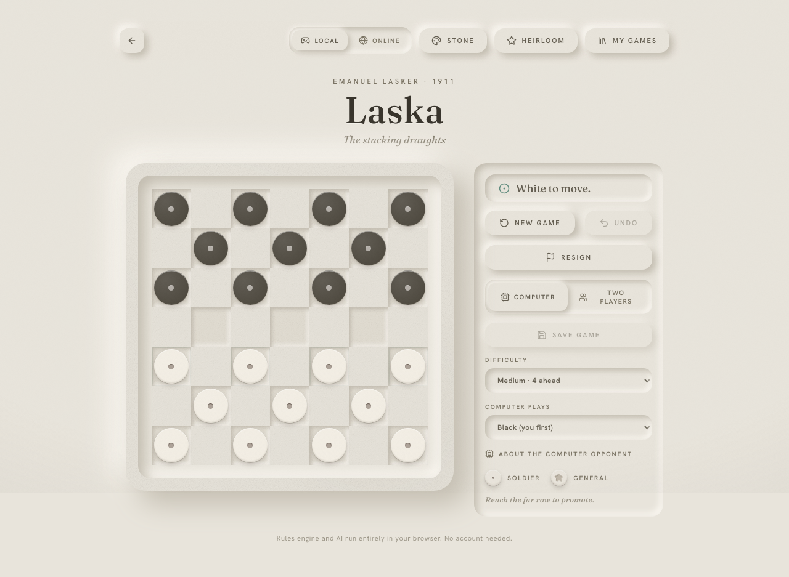
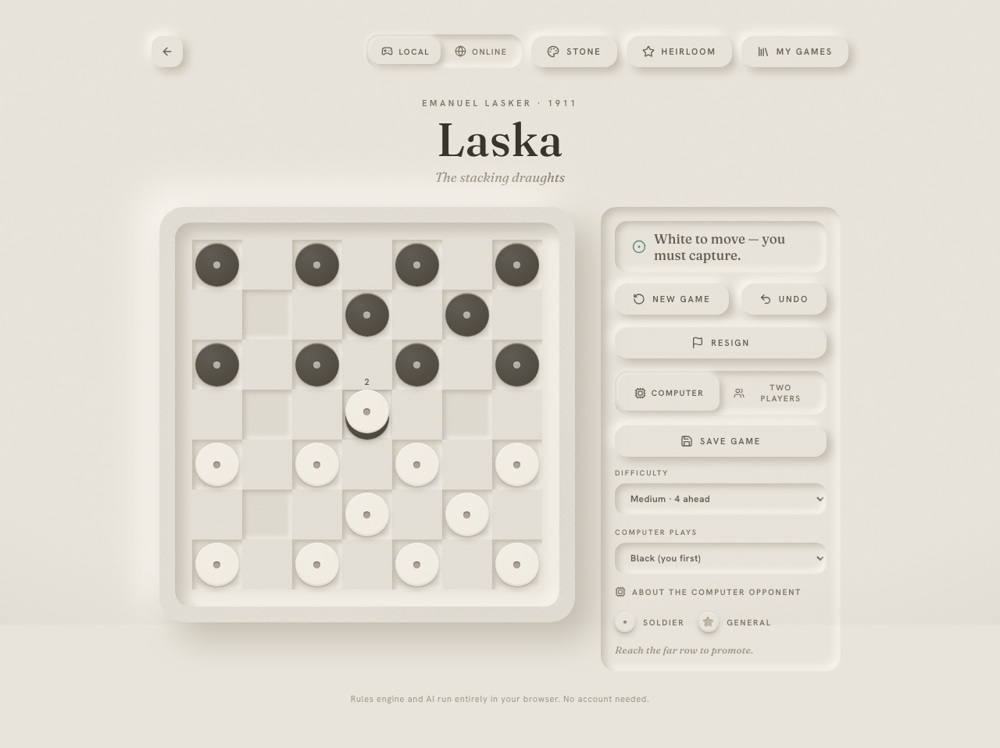
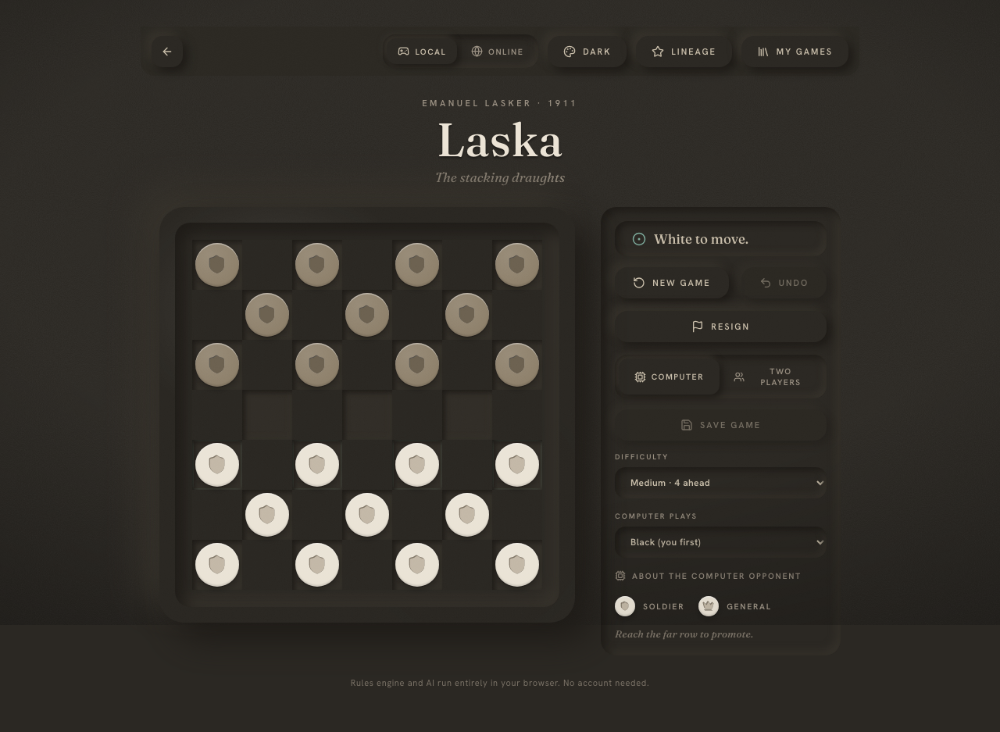
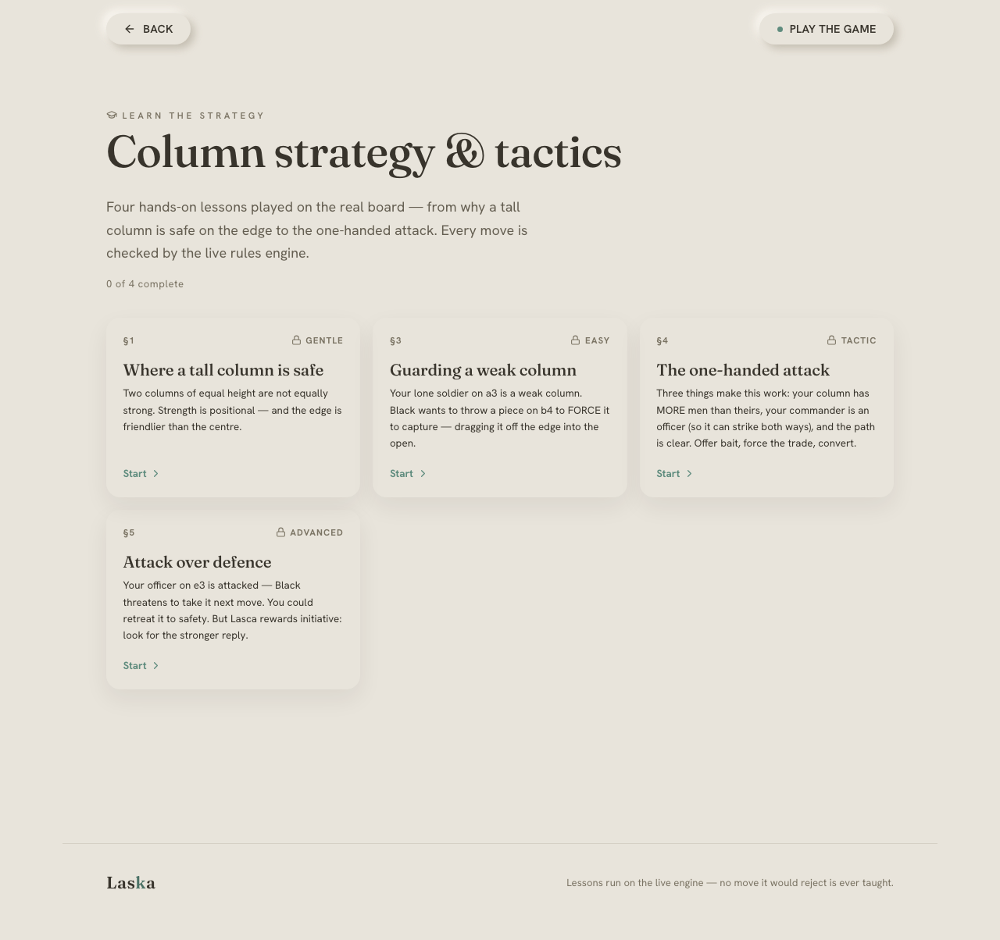
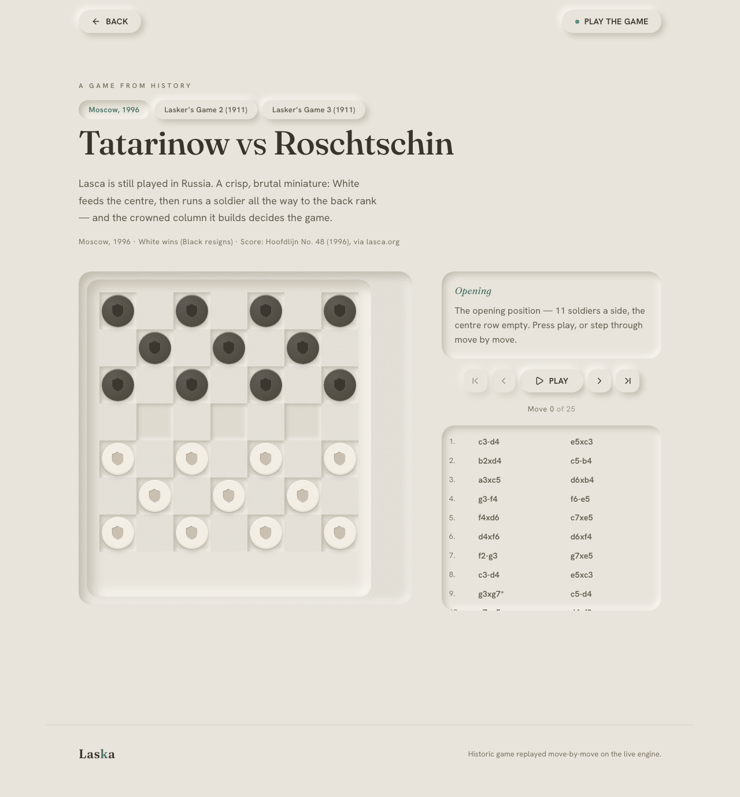
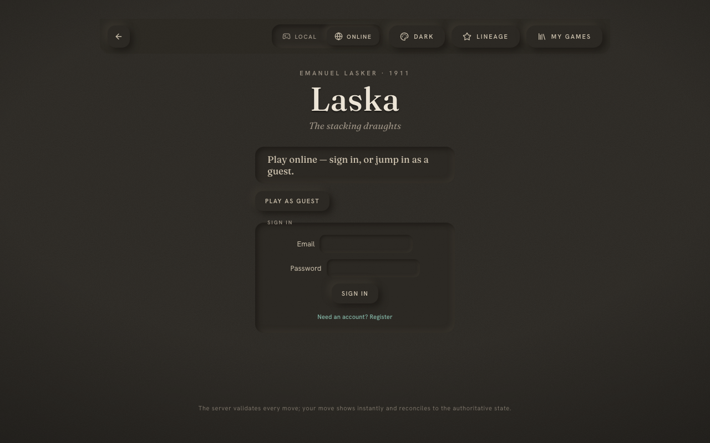
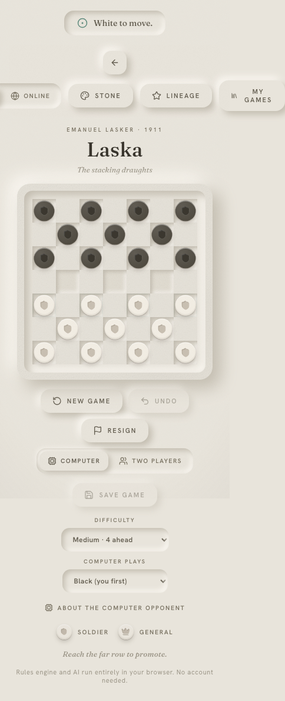

<div align="center">

# Laska (BETA)

### The stacking draughts — invented by a world chess champion in 1911

*It looks like checkers. Then the first piece you capture climbs **underneath** yours instead of leaving — and the whole board starts growing into towers.*

&nbsp;



&nbsp;


-blue)


</div>

---

## 🧒 Explain it like I'm five

You know **checkers**? Little round pieces on a board. You jump over your friend's
piece, and it gets taken off the board. Gone forever.

**Laska is checkers with one magic change:**

> When you jump a piece, it doesn't leave. It **slides under yours** and becomes
> your prisoner. Now the two pieces move together as a little tower — and whoever is
> sitting *on top* is the boss.

So the board never empties out. It **grows upward**. Jump enough pieces and you're
pushing around tall towers of trapped prisoners. And here's the twist that makes
grown-ups love it: if someone captures the *top* of your tower, the boss changes —
and all those prisoners underneath suddenly switch sides and work for the enemy.

Nobody ever really dies. They just change who they're working for. That's the
whole game: **don't count pieces — count towers.**

<div align="center">

<br>
<sub><i>A real capture in the app — the little <b>2</b> badge means this coin is now a 2-tall tower. The prisoner is trapped underneath.</i></sub>
</div>

### The three rules that are different from checkers

| Checkers | Laska |
|---|---|
| Captured pieces leave the board | Captured pieces slide **under** you as prisoners |
| You count how many pieces you have | You watch who **commands** each tower (the top piece) |
| Take an enemy and it's gone | Take an enemy tower and you only grab its **leader** — the prisoners below go free under a new boss |

Eleven pieces a side. **Nothing is ever erased.** You win by burying or cornering
your opponent — not by clearing the board.

---

## ▶️ Play it in 30 seconds

You don't need an account, a key, or anything to configure.

```bash
cd web
npm install
npm run dev          # → http://localhost:5173
```

That's the whole thing. Requires **Node 22 or newer**. Or just go to
**[playlaska.com](https://playlaska.com)** and start playing.

---

## ✨ What you can do

### 🤖 Play a computer that actually understands towers

Most checkers bots just count pieces. That's useless in Laska, where a captured
piece is a *life you can win back later*. Our opponent thinks in towers instead —
and you can pick from **six honest difficulty levels**, from a beginner that
genuinely blunders to an expert that looks eight moves ahead. (The full game
screen — board plus the difficulty and opponent panel — is the hero shot at the
top of this page.)

### 🎨 Make it beautiful — themes & pieces

Five hand-built color palettes and several piece styles. Generals can wear a
debossed **star**, **crown**, or **shield**, pressed *into* the coin like a wax
seal. The whole board is **neumorphic** — soft clay, sculpted only with light and
shadow, never flat and never loud.

<div align="center">

</div>

### 🎓 Learn the strategy, hands-on

Four short lessons played **on the real board** — why a tall tower is safer on the
edge, how to guard a weak column, and the famous "one-handed attack." Every move
you try is checked by the live rules engine, so you can never be taught a move the
game would reject.

<div align="center">

</div>

### 📜 Replay real games from history

Step move-by-move through real recorded matches — including **two of Lasker's own
teaching games from 1911** — replayed on the same live engine you play against.
They're not pictures; the engine actually re-plays every move.

<div align="center">

</div>

### 🌐 Play other people online

Sign in (or jump in as a guest), get matched by skill, and play a real-time game
with clocks, chat, rematches, and reconnection if your wifi blips. **Every single
move is re-checked on the server** — nobody can cheat the rules.

<div align="center">

</div>

### 📱 Plays great on your phone

The whole board and controls reflow to a single tidy column on mobile. There's
also a native iOS + Android build in the works.

<div align="center">

</div>

---

## 👴 Who invented this game (the real story)

Laska was made by **Emanuel Lasker** — and he was not a casual hobbyist.

He was the **World Chess Champion for 27 years**, longer than anyone before or
since. He was *also* a doctor of mathematics (a theorem with his name still sits
under modern algebra), a published philosopher, and a friend of Albert Einstein.
Born on Christmas Eve in 1868 to a Jewish cantor's family, he was forced out of
Nazi Germany in 1933 and lived his last years in exile, dying in New York in 1941.

He loved chess, Go, and bridge — but **Laska was the one game he invented himself.**
He called it *"the game to teach cautiousness and tactics, and a great builder up
of ideas."* It nearly vanished for a century. This app brings it back, faithfully.
There's a fuller telling of his life inside the app.

---

# 🛠️ How we built it

> The rest of this README is for the curious — the "how does it actually work"
> half. Laska is a ~12,000-line, strict-TypeScript project built around **one
> stubborn idea: the rules of the game are written exactly once.**

### The simple version

Imagine three things that all need to agree on what a *legal move* is: the game on
your screen, the computer opponent, and the online server that referees matches
between strangers. If you wrote the rules three times, they'd eventually disagree —
and a bug where the server thinks a move is illegal but your screen thinks it's
fine is a nightmare.

So we wrote the rules **once**, in one little engine, and everything else *borrows*
it. The screen, the bot, and the server all run the *exact same* rule code. They
literally cannot disagree, because it's the same function.

### The one-engine architecture

```
                    ┌─────────────────────────────┐
                    │  src/  — the rules engine    │
                    │  pure · zero-deps · strict   │
                    │  legalMoves · applyMove ·    │
                    │  gameStatus · ai (negamax)   │
                    └──────────────┬──────────────┘
                       imports     │     imports
              ┌────────────────────┴────────────────────┐
              ▼                                          ▼
   ┌────────────────────┐                  ┌──────────────────────────┐
   │  web/  React + Vite │                  │  server/  WebSocket + ws │
   │  board · themes ·   │   shared types   │  authoritative matches · │
   │  replay · online UI │◀ ─ ─ ─ ─ ─ ─ ─ ─ │  matchmaking · Elo · DB  │
   └────────────────────┘   protocol.ts     └──────────────────────────┘
```

`src/` has **zero runtime dependencies** and is the single source of truth. The web
client and the server don't re-implement it — they `import` it directly. The only
thing crossing the boundary is the message format (`server/src/net/protocol.ts`),
which the client also imports — so a protocol change is a *compile error*, not a
runtime surprise.

The proof it's faithful: the engine **replays Lasker's own 1911 games
move-for-move** at build time. Break a rule and a 113-year-old game stops
replaying — and the build fails.

### The opponent AI

A piece-counting bot plays Laska badly, because every buried prisoner is a life you
can recapture. So the AI is built to think in towers:

- **Negamax search with alpha-beta pruning** over the capture-heavy move tree, plus
  a **quiescence search** that plays out exchanges to the end before judging a
  position — so it never makes a "looked good for one move" blunder.
- A **column-aware evaluation** that scores tower control, commander rank, buried
  prisoners, promotion threats, and mobility — drawn from documented Laska strategy
  ([`STRATEGY.md`](STRATEGY.md)), including edge-safety for tall towers.
- **Six difficulty tiers** that scale how deep it searches and how often it
  blunders, so a beginner is genuinely beatable without the code faking it.

Its strength is *measured*, not asserted: a frozen reference search in the test
suite catches any drift, and an **agent arena** (`src/agents/`) pits it against
random, greedy, and Monte-Carlo opponents in round-robin matches. (Deep dives:
[`AI.md`](AI.md), [`AI_RESEARCH.md`](AI_RESEARCH.md).)

### How we know it works

| Suite | What it covers |
|---|---|
| **Engine (55+)** | rules, captures, promotion, notation round-trips, AI search — plus a self-play harness that plays full games asserting *only legal moves, no exceptions, and all 22 pieces conserved* |
| **Server (76+)** | match lifecycle, matchmaking, Elo, auth — and a **storage contract test run against every backend** (in-memory, SQLite, Postgres) plus a cluster-fabric parity test (in-memory and Redis) |
| **Playwright e2e** | the real online flow, end-to-end against a running server |

Strict TypeScript everywhere (`noUncheckedIndexedAccess`,
`exactOptionalPropertyTypes`), CI on GitHub Actions, and a deliberate
**no-build-step** stance: the engine and server run raw `.ts` via Node 22's native
type-stripping, so there's no compiled artifact that can drift from the source.

### Built by a team of AI agents

Laska was built with a roster of **specialised AI engineering agents** — an engine
engineer, a game-AI engineer, a frontend engineer, a backend engineer, and more —
each scoped to one domain and each gated by the same verification loop a human team
would use: typecheck, run the tests, and replay Lasker's 1911 games. The honest,
milestone-by-milestone record (including what's deliberately *not* done yet) lives
in [`BUILD_LOG.md`](BUILD_LOG.md).

---

## 📂 Project layout

```
src/        Rules engine + AI — the heart of it (pure, zero-deps, the source of truth)
test/       Engine + AI tests (incl. self-play invariants & a frozen reference search)
web/        React + Vite app you play
server/     Online backend: WebSocket, matchmaking, Elo, pluggable storage + cluster
e2e/        Playwright end-to-end tests
mobile/     Native iOS + Android build (Expo / React Native, shared engine)
docs/       Screenshots and the README blueprint
STRATEGY.md Canonical strategy reference the AI heuristic traces back to
DESIGN.md   The neumorphic design system
CLAUDE.md   Engineering guide: exact commands, project map, conventions, DoD
```

## 🤝 For developers

Working on the code? Start with [`CLAUDE.md`](CLAUDE.md) — the engineering guide
with exact commands per package, the project map, conventions, and the
verification loop. The engine, web app, and server are three separate npm packages
(`npm install` in each); from the repo root, `npm test` runs the full engine suite.

> **The rules, honestly.** Our ruleset is reconciled with Lasker's original *Rules
> of Lasca, the Great Military Game* (1911) and confirmed by replaying his own
> published games. One genuinely interpretive point — whether you *must* take the
> longest capture — is documented in the app: Lasker advised "the longest run or
> best advantage," which we read as guidance, so the choice is yours.

---

<div align="center">

*A century-old game, built for now.* **Your move.**

[**▶ Play at playlaska.com**](https://playlaska.com)  ·  [Rules](DESIGN.md)  ·  [How it was built](BUILD_LOG.md)  ·  [The AI](AI.md)

</div>
